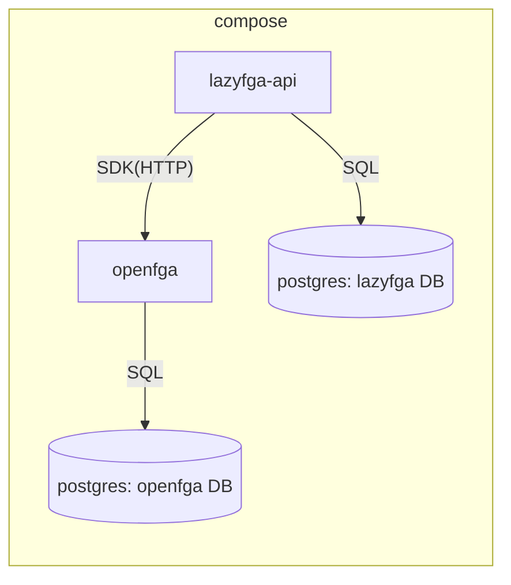

# Self-Host Compose (OpenFGA + Postgres) - Spec Proposal

| Item       | Detail                           |
|------------|----------------------------------|
| Author     | Seonguk Moon                     |
| Created    | 2026-06-28                       |
| Status     | **Implemented**                  |
| Reviewers  | Claude, Codex (M0 cross-review)  |

---

## 1. Summary

`docker-compose` 한 방으로 OpenFGA·Postgres·lazyFGA(api)를 함께 띄우는 self-host 환경을 정의한다. lazyFGA가 쓰는 Postgres 연결과 OpenFGA SDK 클라이언트 래퍼, DB 마이그레이션(Drizzle) 골격을 포함한다.

## 2. Background & Motivation

- 제품 정체성이 **self-hosted**이므로, "받아서 한 번에 띄운다"는 경험이 출품 데모의 첫인상이다.
- ARCHITECTURE.md 결정: **OpenFGA는 별도 컨테이너(자기 store/DB)**, **데이터 소유 분리**(lazyFGA Postgres = 정책·audit·token·모델 메타 / OpenFGA = model·tuple).
- 단일 store 결정(ROADMAP)에 따라, lazyFGA는 부팅 시 OpenFGA store 1개를 보장(없으면 생성)한다.

## 3. Goals & Non-Goals

### 3.1 Goals

- [ ] `docker-compose.yml`: `openfga`, `postgres`(lazyFGA용), `lazyfga-api` 3개 서비스. (OpenFGA 자체 DB는 같은 postgres 인스턴스의 별도 데이터베이스/스키마를 사용)
- [ ] `.env.example` 정의: DB 접속, OpenFGA 엔드포인트, `LAZYFGA_STORE_ID`(선택), `ADMIN_TOKEN`(후속 `lazyfga-10`).
- [ ] `apps/api/src/db`: Drizzle client + 초기 마이그레이션(빈 스키마, 후속 명세가 테이블 추가).
- [ ] `apps/api/src/openfga`: OpenFGA SDK 단일 진입점 래퍼 + **store 부트스트랩**(지정 store 확인, 없으면 생성).
- [ ] api 부팅 시 OpenFGA·Postgres 연결 헬스 체크.

### 3.2 Non-Goals

- [ ] OpenFGA를 프로덕션급으로 튜닝(HA, 백업)하는 것.
- [ ] 인증/서비스 토큰 로직(= `lazyfga-10`).

## 4. Technical Design

### 4.1 Architecture Overview



- `openfga`: 공식 이미지. datastore=postgres. 기동 전 `openfga migrate`로 OpenFGA 스키마 준비.
- `postgres`: 단일 인스턴스 내 `lazyfga`/`openfga` 두 데이터베이스 분리(소유 분리 원칙).
- `lazyfga-api`: `apps/api`. 환경변수로 OpenFGA URL·DB URL 주입.

### 4.2 Data Model Changes

- 신규 DB `lazyfga` 생성(빈 스키마). 테이블은 후속 명세에서 추가:
  - `lazyfga-7`(모델 버전 메타), `lazyfga-8`(named policy), `lazyfga-10`(service token), `lazyfga-17`(audit).
- Drizzle 마이그레이션 디렉터리 `apps/api/src/db/migrations` 초기화.

### 4.3 Core Logic

OpenFGA store 부트스트랩(단일 store 결정의 구현):
1. 부팅 시 `LAZYFGA_STORE_ID`가 주어지면 해당 store 존재를 확인한다.
2. 없거나 미지정이면 `CreateStore(name="lazyfga")` 호출 후 반환된 storeId를 보관(메모리 + `lazyfga` DB의 단일 행 `instance_config`에 영속).
3. 이후 모든 OpenFGA 호출은 이 storeId를 사용한다. (인스턴스당 store는 정확히 1개)

연결 헬스:
- Postgres: `SELECT 1`. OpenFGA: `ListStores`/`ReadAuthorizationModels` 호출 성공 여부. 둘 중 하나 실패 시 `/healthz`는 503.

## 5. API Design

### 5-1. New / Modified

```ts
// apps/api/src/openfga/client.ts
/** 단일 store에 바인딩된 OpenFGA 클라이언트 진입점. 부팅 시 store를 보장한다. */
export interface OpenFgaGateway {
  /** 부팅 시 1회: store 확인/생성, storeId 확정. */
  bootstrap(): Promise<{ storeId: string }>;
  check(req: CheckRequest): Promise<CheckResponse>;       // lazyfga-9
  expand(req: ExpandRequest): Promise<ExpandResponse>;    // lazyfga-11
  write(req: WriteRequest): Promise<void>;                // lazyfga-7/16
  writeAuthorizationModel(model: AuthModel): Promise<{ authorizationModelId: string }>; // lazyfga-7
}
```

```
GET /healthz → 200 { status:"ok", openfga:"up", db:"up", storeId } | 503 (의존성 다운)
```

### 5-2. Error Handling

| 상황 | 처리 |
|------|------|
| OpenFGA 미기동/연결 실패 | api 부팅 재시도(backoff) 후 실패 시 `/healthz` 503 |
| Postgres 연결 실패 | 동일(503) |
| store 생성 권한/오류 | 부팅 실패, 명확한 로그 |

## 6. Implementation Plan

### 6-1. Milestones

| Phase   | Task                                                  | Estimated | Owner |
|---------|-------------------------------------------------------|-----------|-------|
| Phase 1 | docker-compose(openfga+postgres+api) + .env.example   | 0.5d      | TBD   |
| Phase 2 | Drizzle client + 빈 마이그레이션 + instance_config 행 | 0.5d      | TBD   |
| Phase 3 | OpenFGA 게이트웨이 래퍼 + store 부트스트랩 + 헬스체크  | 1d        | TBD   |

### 6-2. Dependencies

- 컨테이너: 공식 `openfga/openfga` 이미지, `postgres` 이미지.
- 라이브러리: `@openfga/sdk`, `drizzle-orm`, `pg`(또는 Bun 내장 postgres).

## 7. References

- [ARCHITECTURE.md](../ARCHITECTURE.md) — 데이터 소유 분리, OpenFGA 별도 컨테이너
- OpenFGA: Running in Production / docker / Postgres datastore 문서
- Drizzle ORM 마이그레이션 문서
