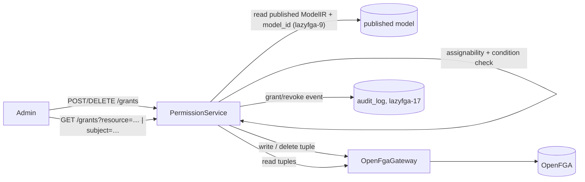

# Permission Management (structured grant/revoke) - Spec Proposal

| Item       | Detail                           |
|------------|----------------------------------|
| Author     | Seonguk Moon                     |
| Created    | 2026-06-30                       |
| Status     | **Implemented**                  |
| Reviewers  | Claude + Codex (spec cross-review + post-implementation adversarial review; all findings applied) |

---

## 1. Summary

A lazyFGA-side, admin-facing capability to **grant and revoke permissions** by writing model-aware role-assignment tuples directly to OpenFGA. It is a **structured `(subject, relation, resource)` assignment** flow, constrained to the published model's *directly-assignable* relations — explicitly **not** a raw arbitrary-tuple editor. This realizes the principle that *permission change & management is lazyFGA's responsibility*, while identity and the login flow stay with the IdP.

## 2. Background & Motivation

- `lazyfga-9` pins evaluation to the **published** model; `lazyfga-15/16` ingest tuples from an IdP webhook; `scripts/` seed tuples for demos. But there is **no first-class way for an admin to grant or revoke a permission from lazyFGA itself** — every grant currently requires the OpenFGA SDK or a seed script.
- `Q4=A` (M5–M7) decided *"no general tuple-write UI"*; tuples come from IdP sync or scripts. **This proposal updates that decision** by adding a *constrained, model-aware* grant/revoke. The **spirit of Q4=A is retained**: the admin never writes arbitrary `object#relation@subject` triples. They pick a subject, a **directly-assignable** relation, and a resource — all validated against the published model. The rejected foot-gun (free-form tuple editing) is still rejected.
- Consequence of the agreed responsibility split: identity lifecycle → IdP (see `lazyfga-21`); **ongoing permission grants/revokes → lazyFGA**. Without this proposal that second half is unimplemented.

## 3. Goals & Non-Goals

### 3.1 Goals

- [ ] **Grant API**: write a single tuple `<resType>:<resId>#<relation>@<subject>` where `<subject>` is a user (`user:<id>`) or a userset (`team:<id>#member`), optionally with a model-defined condition + context.
- [ ] **Revoke API**: delete the same assignment tuple.
- [ ] **List API**: read current assignments for a given **resource** (a paginated OpenFGA Read — the gateway follows `continuation_token` so the list is never silently truncated to the first page), or for a **subject** within a given resource type. (OpenFGA's Read requires an object **type** alongside a user filter, so a cross-all-types subject view fans out one Read per object type in the published model.)
- [ ] **Model-aware validation**: the `(relation, resourceType)` pair must be **directly-assignable** in the published model, and the subject's type (or userset `type#relation`) must be among that relation's allowed directly-related types. Purely-computed relations and disallowed subject types are rejected with a clear error *before* hitting OpenFGA.
- [ ] **Web UI**: grant/revoke from the existing permission matrix (or a dedicated grants panel); the list shows who-has-what with a Revoke action.
- [ ] **Audit** (`lazyfga-17`): record every **state-changing** grant/revoke (a genuinely new tuple / a real delete) with the principal actor and assignment details; idempotent no-ops are not audited as changes.

### 3.2 Non-Goals

- [ ] Raw arbitrary tuple editing — still forbidden; only model-validated assignments (Q4=A spirit).
- [ ] Bulk import / migration of tuples (use `scripts/` or IdP sync, `lazyfga-21`).
- [ ] Authoring the **model** itself (`lazyfga-5` canvas) — this writes *data* (tuples), not the *model*.
- [ ] Granting on **purely-computed** relations (no direct type restriction — e.g., a `viewer` derived solely via `parent`); only relations with a direct type restriction are grantable. A relation that is partly direct and partly computed (e.g. `[user] or editor`) is grantable on its direct part. Inheritance is expressed in the model, not by writing tuples.
- [ ] **Object-reference relations** — relations whose direct type restriction admits a typed **object** rather than a user/userset (e.g. `define parent: [folder]`, assigned as `document:x#parent@folder:y`). Although such a relation technically has a direct type restriction, its subject (`folder:y`) falls outside §3.1's subject scope (**user | userset**). The grantable surface is therefore exactly *user/userset-assignable* relations: `ResourceType.roles` and `GroupType.member`. Establishing hierarchy edges (`document#parent@folder`) remains a scripts/IdP-sync concern, consistent with the bulk-import Non-Goal above.
- [ ] **Public-access wildcard** subjects (`user:*`); v1 grants concrete users and usersets (`type#relation`) only.
- [ ] Time-travel / scheduled grants. A grant takes effect immediately (conditions, `lazyfga-14`, cover time-bounded access instead).

## 4. Technical Design

### 4.1 Architecture Overview



The flow is: validate against the **published** model (the same model active in OpenFGA), then write/delete a single tuple through the existing gateway, then audit. Reads use the OpenFGA Read API to list current assignments.

### 4.2 Data Model Changes

**No new Postgres tables.** Assignments live as OpenFGA tuples; audit reuses `audit_log` (`lazyfga-17`).

### 4.3 Core Logic

- **Resolve published model**: load the current published `ModelIR` and its OpenFGA `authorization_model_id` (`lazyfga-9`). If no model is published yet → `404 no_published_model`.
- **Assignability check** (against `ModelIR`): the target `relation` on `resourceType` must be **directly-assignable** — i.e., its definition includes a direct type restriction (it is an assignable role/relation), not *solely* a computed union/intersection/TTU. The subject's type (or userset `type#relation`) must be listed among that relation's allowed directly-related user types. This mirrors OpenFGA's own write-time validation, surfaced early for UX and to drive valid UI choices.
- **Condition (optional, `lazyfga-14`)**: a grant may carry `condition: { name, context }`. The `name` must exist in the published model **and** be permitted on that relation's type restriction for the subject type (`lazyfga-14` attaches conditions at the SubjectRef/type-restriction level). The tuple is written carrying the condition name + context. **lazyFGA never evaluates the condition** — OpenFGA evaluates it at Check time (`Q2=A`). Conversely, if the relation's **only** directly-related entry for the subject type is conditioned (`[user with cond]`), a grant for that subject type **must** carry a matching condition; `validateGrant` rejects a conditionless grant in that case (OpenFGA would otherwise reject the write).
- **Write / delete**: through `OpenFgaGateway` using the published `authorization_model_id`. The write uses **duplicate-as-error** (not silent-ignore) so the service can distinguish a state change from a no-op: a genuinely new tuple → `201` (audited as a change); a duplicate-write error (the `lazyfga-15` idempotent class) → `200` no-op (not audited). Revoke is symmetric and uses **missing-as-error** (OpenFGA's default): a real delete → `200` (audited); a missing-tuple delete surfaces the missing-delete error (the `lazyfga-15` idempotent class), caught → `200` no-op (not audited). No pre-read is required to detect the no-op. A **non-duplicate** invalid-input rejection (a model/type mismatch that slipped past our check, e.g., a race against a re-publish) → deterministic `400` carrying the OpenFGA reason; transient/5xx → `502` (reuse the `lazyfga-15` classification semantics).
- **List**: by **resource** → `gateway.read` filtered by object. By **subject** → OpenFGA's Read requires an object **type** alongside the user filter, so a subject-scoped query takes a resource **type**, or, when omitted, fans out one Read per object type in the published model and merges. `gateway.read` is **paginated** internally — it loops over `continuation_token` until exhausted so a large assignment set is returned in full (never silently capped at the first page). The relation set shown is constrained to the published model's assignable relations. A deterministic 4xx read rejection → `400`; transient/5xx → `502` (§5-2).

## 5. API Design

### 5-1. New / Modified

```ts
// apps/api/src/modules/permission  (admin-guarded)

// Subject is either a concrete user or a userset (group membership).
type GrantSubject =
  | { type: string; id: string }                 // user:alice
  | { type: string; id: string; relation: string }; // team:eng#member

interface GrantRequest {
  subject: GrantSubject;
  relation: string;                  // must be directly-assignable on resource.type
  resource: { type: string; id: string };
  condition?: { name: string; context?: Record<string, unknown> }; // lazyfga-14; optional
}

// POST   /grants   → write one assignment tuple.  201 (created) | 200 (already existed, no-op)
// DELETE /grants   → delete one assignment tuple.  200 (deleted | already absent, no-op)
//   body: { subject, relation, resource }   // NO condition: OpenFGA deletes key on
//   (user, relation, object) only; a tuple's condition is not part of its identity.

// GET /grants?resource=<type>:<id>                  → assignments on a resource (one Read)
// GET /grants?subject=<type>:<id>[#<relation>][&resourceType=<t>] → assignments a subject holds
//   (subject may be a userset, e.g. subject=team:eng#member)
//   (OpenFGA Read needs an object type with a user filter; with resourceType → one Read,
//    without → fan out one Read per object type in the published model and merge)
//   → { grants: Array<{ subject, relation, resource, condition? }> }

// Service (pure-ish, testable): validates against the published ModelIR before any write.
function validateGrant(model: ModelIR, req: GrantRequest):
  | { ok: true }
  | { ok: false; code: GrantErrorCode; message: string };
```

`validateGrant` is unit-testable without OpenFGA and is the early UX gate; OpenFGA remains the authoritative backstop at write time.

### 5-2. Error Handling

| Status | Description |
|--------|-------------|
| 200    | Grant/revoke succeeded, or idempotent no-op (already present / already absent). Also: `GET /grants` success. |
| 201    | New assignment created (a genuinely new tuple). |
| 400    | Relation not directly-assignable; subject type not allowed for the relation; missing-but-required condition or unknown/not-permitted condition; malformed subject/resource; non-duplicate OpenFGA invalid-input backstop. **GET**: neither or both of `resource`/`subject` supplied. |
| 401/403| Missing/insufficient admin auth. |
| 404    | No model published yet (`no_published_model`) — applies to writes and to `GET`. |
| 502    | OpenFGA transient/5xx while writing **or** reading. |

## 6. Implementation Plan

### 6-1. Milestones

| Phase   | Task                                                                                          | Estimated | Owner |
|---------|-----------------------------------------------------------------------------------------------|-----------|-------|
| Phase 1 | `PermissionService` + `validateGrant` (assignability vs published ModelIR) + `POST`/`DELETE /grants` for **user and userset subjects** + idempotency (duplicate/missing-as-error) + audit + tests. **A request carrying `condition` is rejected with a deterministic `400 condition_not_yet_supported` until Phase 3.** | 1.5d | TBD |
| Phase 2 | `GET /grants` (read-back via OpenFGA Read, incl. userset subject encoding) + web grant/revoke in the permission matrix | 1d | TBD |
| Phase 3 | Condition-attached grants (`lazyfga-14`) — accept and validate `condition` per the type restriction — + Chrome MCP E2E | 1d | TBD |

### 6-2. Dependencies

- `lazyfga-5` (ModelIR + model store), `lazyfga-9` (published model + `OpenFgaGateway`), `lazyfga-14` (conditions), `lazyfga-17` (audit), `lazyfga-2`/permission-matrix (web surface).
- `@openfga/sdk` Write/Read/Delete APIs.

## 7. References

- [CONCEPT.md](../CONCEPT.md), [ARCHITECTURE.md](../ARCHITECTURE.md)
- `lazyfga-9` (evaluate/publish + gateway), `lazyfga-14` (conditions), `lazyfga-17` (audit), `lazyfga-21` (IdP ingestion — the identity-lifecycle counterpart)
- OpenFGA Write API and direct-assignment / type-restriction validation semantics.
