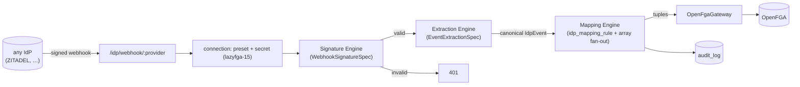

# Generic IdP Webhook Ingestion Framework - Spec Proposal

| Item       | Detail                           |
|------------|----------------------------------|
| Author     | Seonguk Moon                     |
| Created    | 2026-06-30                       |
| Status     | **Implemented**                  |
| Reviewers  | Claude + Codex (spec cross-review + post-implementation adversarial review vs real ZITADEL source; all findings applied) |

---

## 1. Summary

Refactor the IdP webhook module from **per-provider adapter code** into a **declarative, config-driven ingestion framework**: one signature-verification engine parameterized by a `WebhookSignatureSpec`, and one event-extraction engine parameterized by an `EventExtractionSpec` (path mappings) that normalize any provider's webhook into the canonical `IdpEvent`. **ZITADEL ships as the first preset** (its real signing scheme + event schema as config), and at least one additional preset (Standard Webhooks / generic HMAC) demonstrates that the framework generalizes. Provider-specific **code drops to ~zero**: adding a provider is authoring a config preset, not writing an adapter.

## 2. Background & Motivation

- `lazyfga-15` built a provider-agnostic webhook receiver + config-driven mapping engine; `lazyfga-16` added a ZITADEL adapter **as code** (bespoke `verifySignature` + `parseEvents`). Maintaining per-provider code is the ad-hoc risk we want to avoid.
- The ZITADEL adapter's *assumed* signing scheme was verified against the real ZITADEL source (`pkg/actions/signing.go`, identical to `zitadel-go`) and found wrong on three axes: timestamp is **Unix seconds** (adapter used milliseconds → every real webhook would 401), the header may carry **multiple `v1=` signatures** for key rotation (adapter kept only the last), and event fields are `event_type` / `event_payload.*` (adapter read `eventType` / `payload.*`). The event aggregate also differs by event family (grant: aggregate is `usergrant`; signup: aggregate is the user).
- Rather than patch the adapter as more bespoke code, **generalize**: express signature + extraction declaratively so ZITADEL becomes a *correct config*, and so other IdPs (Auth0/Keycloak/Okta/Stripe-style/Standard Webhooks) are addable as config. This is the explicit design constraint: minimize provider-specific code, with enough generality to justify multiple providers.

## 3. Goals & Non-Goals

### 3.1 Goals

- [ ] **`WebhookSignatureSpec` + one verification engine** covering: header name, header parse format, timestamp source/unit, signed-payload template, digest algorithm, encoding, replay tolerance, and multiple-signature acceptance.
- [ ] **`EventExtractionSpec` + one extraction engine** (dotted-path based) normalizing a parsed payload into the canonical `IdpEvent` (`type`, `subject`, `attributes`), including array-valued attributes.
- [ ] **Mapping engine extension** (`lazyfga-15`) for **array fan-out** (e.g., `roleKeys[]` → one tuple per role), including widening `IdpEvent.attributes` to allow array values and re-validating each fanned element through the existing injection guard.
- [ ] **ZITADEL preset** matching the real spec — **one preset carrying per-event-type extraction rules**: a signup rule (`user.human.added` / `user.human.selfregistered`) → default-relation; a grant rule (`user.grant.added` / `…removed`) → role bindings.
- [ ] **Migrate** the `lazyfga-19` demo (`demo/run.ts`) and `seed-zitadel-rules.ts` to the corrected ZITADEL shape/units (`event_type` / `event_payload.*` / **seconds** timestamp) and relocate the signing helper that is deleted with the adapter.
- [ ] **At least one additional preset** (Standard Webhooks, or a generic HMAC preset) shipped and tested to prove multi-provider generality.
- [ ] Provider-specific **code reduced to an optional thin escape-hatch only** — none required for the shipped presets.
- [ ] Signing-secret handling unchanged (write-only, never returned/logged); audit unchanged (`lazyfga-17`).

### 3.2 Non-Goals

- [ ] **Non-HMAC** signature schemes — asymmetric **JWT/JWS/JWE**-signed webhooks (ZITADEL also supports these) and mTLS. v1 targets HMAC (ZITADEL's signing-key / `ZITADEL-Signature` mode); JWT mode is a documented follow-up extension point on the same `WebhookSignatureSpec`.
- [ ] OAuth/OIDC **login** flow — that is the IdP's job and out of scope (lazyFGA consumes events, it does not authenticate end users).
- [ ] A **visual spec/preset authoring UI**. Presets are seeded in-repo; connection CRUD (`lazyfga-15`) lets an admin pick a preset and supply the secret. A visual editor is future work.
- [ ] Replacing the **tuple-write path for admin grants** — that is `lazyfga-20`. This proposal only ingests IdP-driven relations.

## 4. Technical Design

### 4.1 Architecture Overview



The receiver, both engines, the mapping engine, and the gateway are **provider-agnostic**. A `provider` resolves to a **preset** (`WebhookSignatureSpec` + `EventExtractionSpec`); ZITADEL and the additional preset are seeded configs, not code paths.

### 4.2 Data Model Changes

- `idp_connection` (`lazyfga-15`) gains a way to reference its specs: either store the resolved `signature_spec` / `extraction_spec` (JSONB), or store a `preset` key resolved against an **in-repo preset registry** (config map). Recommended: a `preset` key + optional JSONB overrides, so connections stay compact and presets are versioned in-repo.
- `idp_mapping_rule` (`lazyfga-15`) gains an explicit **`fanOut?: string`** field naming the array attribute to expand; when set, the engine emits one tuple per element (bound via `{{item}}`), otherwise one tuple as today. Validated at rule create/update time (on both paths, against the **merged** rule): the tuple template must reference `{{item}}`, and `fanOut` must name an attribute the connection preset's matched extraction rule **produces** (`attributePaths` key — catches typos / non-produced names). Array-ness itself is enforced at runtime — a scalar or absent attribute simply fails `matchRule` (the fan-out source must be a non-empty array), so the rule never fires rather than mis-writing. Conversely a template referencing `{{item}}` with no `fanOut` is rejected (it would always fail to render).
- Migration: next sequential Drizzle migration number (generated, not hardcoded).

### 4.3 Core Logic

**Signature engine** — `verify(spec, rawBody, headers, secret) → boolean`:
- Parse the signature header per `spec.headerFormat`; collect timestamp (from the signature header or a separate header per `spec.timestampSource`) and one-or-more signature values.
- Build the signed payload from `spec.payloadTemplate` with placeholders `{body}`, `{timestamp}`, `{id}` (id sourced from `spec.idSource` when the template uses it).
- Compute `HMAC(spec.algorithm, secret, signedPayload)`, encode per `spec.encoding` (hex|base64), and compare (timing-safe) against **each** provided signature; accept if any matches (key rotation).
- Enforce replay tolerance against `spec.toleranceSec` when a timestamp is present; reject too-old. (lazyFGA keeps a both-sided check as a deliberate hardening; future timestamps beyond tolerance are also rejected.)

```ts
interface WebhookSignatureSpec {
  header: string;                          // e.g. "ZITADEL-Signature"
  headerFormat: "kv_t_v" | "scheme_hex" | "standard_webhooks";
  timestampSource: "signature_header" | "separate_header" | "none";
  timestampHeader?: string;                // when timestampSource = "separate_header" (e.g. "webhook-timestamp")
  timestampUnit: "seconds" | "millis" | "none"; // "millis" is future-proofing; no shipped preset uses it
  idSource?: { header: string };           // for templates needing {id} (e.g. Standard Webhooks "webhook-id")
  payloadTemplate: string;                 // "{timestamp}.{body}" | "{id}.{timestamp}.{body}" | "{body}"
  algorithm: "sha256";
  encoding: "hex" | "base64";              // encoding of the signature value in the header
  secretEncoding: "raw" | "base64";        // how the stored secret decodes into HMAC key bytes
  secretPrefix?: string;                   // stripped before decode (e.g. "whsec_" for Standard Webhooks)
  toleranceSec: number;                    // e.g. 300; rejects too-old (and, deliberately, far-future —
                                           //   window must exceed expected upstream clock skew)
  allowMultipleSignatures: boolean;
}
```

**Coverage (one engine, config only):**

| Provider | header | format | ts | payload | sig enc | secret |
|----------|--------|--------|----|---------|---------|--------|
| ZITADEL  | `ZITADEL-Signature` | `kv_t_v` | seconds (in-header) | `{timestamp}.{body}` | hex | raw |
| Stripe-style | `Stripe-Signature` | `kv_t_v` | seconds | `{timestamp}.{body}` | hex | raw |
| Standard Webhooks | `webhook-signature` | `standard_webhooks` | seconds (`webhook-timestamp`) | `{id}.{timestamp}.{body}` | base64 | base64 (strip `whsec_`) |
| GitHub   | `X-Hub-Signature-256` | `scheme_hex` | none | `{body}` | hex | raw |

All presets set `allowMultipleSignatures: true` except GitHub (single `sha256=` value); `secretEncoding` is `raw` except Standard Webhooks (`base64`, strip `whsec_`).

**Extraction engine** — `extract(preset, parsedBody) → IdpEvent | null`:
- Read the event type once via `preset.typePath` (e.g. `event_type`).
- Select the **first extraction rule whose `match` includes that event type**. No matching rule → `null` (event ignored — not every IdP event maps to a relation).
- From the selected rule: `subjectIdPath` → subject id (must be a non-empty **string**; **not** coerced — the `lazyfga-16` hardening); `subjectType` fixed per rule; `attributePaths` → each path yields either a **scalar** (string/number/bool → coerced to string) or an **array** of scalars. Hence `IdpEvent.attributes` is `Record<string, string | string[]>`. Missing/empty required subject → `null` (skipped, logged).

```ts
// A preset carries the signature spec + the event-type path + a LIST of
// per-event-type extraction rules. This is what lets ONE provider/connection
// handle multiple event families (e.g. ZITADEL signup AND grant), which a
// single subjectIdPath could not.
interface ProviderPreset {
  signature: WebhookSignatureSpec;
  typePath: string;                          // "event_type"
  extraction: EventExtractionRule[];
}
interface EventExtractionRule {
  match: string[];                           // event types this rule applies to
  subjectType: string;                       // "user"
  subjectIdPath: string;                     // path to the subject id within the matched event
  attributePaths: Record<string, string>;    // value or array; an array source feeds fan-out
}
```

**ZITADEL preset (one preset, `typePath: "event_type"`, extraction rules — verified against source):**
- *Signup rule* — `match: ["user.human.added","user.human.selfregistered"]` (prefix `user.` `user/user.go:15` + `human.` `user/human.go:17`). These are **user-aggregate** events (`user/aggregate.go:8 AggregateType="user"`), so top-level `aggregateID` **is the new user's id** → `subjectIdPath: "aggregateID"`, attribute `org: "resourceOwner"`. Mapping rule writes the default relation `org:{{attributes.org}}#member@user:{{subject}}`.
- *Grant-added rule* — `match: ["user.grant.added"]`: these are **usergrant-aggregate** events (`usergrant/aggregate.go:8 AggregateType="usergrant"`), so `aggregateID` is the grant's id, **not** the granted user → `subjectIdPath: "event_payload.userId"`, attribute `project: "event_payload.projectId"`. Mapping rule writes a project membership `project:{{attributes.project}}#member@user:{{subject}}`.
- *Grant-removed rule* — `match: ["user.grant.removed"]`: same subject/project extraction; its mapping rule **deletes** that project membership (symmetric with added). **Critical:** `UserGrantRemovedEvent` carries **no `roleKeys`** (its only payload fields are `userId`/`projectId`/`grantId`, `usergrant/user_grant.go`), so per-role revocation is impossible from the webhook. The ZITADEL grant rules therefore operate at **project granularity** (symmetric add/remove); fine-grained per-role grant/revoke is `lazyfga-20`'s domain.
- *Fan-out worked example*: `event_payload.roleKeys` (present **only** on `user.grant.added`) is the demonstration of the array fan-out engine feature — an optional added-only rule may emit one role tuple per key — but it is deliberately **not** the default ZITADEL grant mapping, precisely because `user.grant.removed` cannot reverse it.

**Array attributes & fan-out (engine change):**
- `IdpEvent.attributes` widens from `Record<string, string>` to `Record<string, string | string[]>` (a path may yield a list, e.g. `roleKeys`).
- The mapping engine (`lazyfga-15` `renderTuple`/`matchRule`) is extended with a rule-level **`fanOut` field** (the array attribute name): when set, the engine emits **one tuple per element**, binding the element via a `{{item}}` placeholder (scalars still bind via `{{attributes.<k>}}` / `{{subject}}` / `{{type}}`). `matchRule` treats the `fanOut` source as "matches if non-empty" rather than scalar equality.
- Each fanned element is validated **individually** by the existing injection guard (`FORBIDDEN_IN_VALUE` = `:#*` + whitespace): a role key containing a forbidden char fails only that element (counted as `failed`), the rest still apply — preserving the `lazyfga-15`/`lazyfga-16` guard.

**Backward compatibility & migration:** the external HTTP contract is unchanged — `POST /idp/webhook/:provider` path/method/status and the connection CRUD shape stay the same. **Internally**, the `IdpAdapter` interface, the adapter registry (`getAdapter`/`registerAdapter`), and the `parseEvents → IdpEvent[]` contract are **deleted**; the handler is rewired to `verifyWebhookSignature(spec, …)` + `extract(preset, …) → IdpEvent | null`, with the mapping engine producing 0..N tuples (incl. fan-out) from that one event. The `lazyfga-16` ZITADEL adapter code is removed and replaced by the ZITADEL preset (signature/parsing reproduced **and corrected**). **Migration deliverables:** (1) `apps/api/scripts/demo/run.ts` moves off the deleted `signatureHeader`/`SIGNING` helper (relocated into the demo or a shared test helper) and emits the **real** shape (`event_type`, `event_payload.userId`/`projectId`, **seconds** timestamp); (2) `scripts/seed-zitadel-rules.ts` mapping templates key on the **canonical extracted attribute** `attributes.project` (mapped from `event_payload.projectId` by the extraction rule) — the mapping engine (`mapping.ts`) resolves `attributes.*` / `subject` / `type`, **not** raw payload paths. Otherwise the demo's self-signed event extracts no subject and is skipped.

## 5. API Design

### 5-1. New / Modified

```ts
// apps/api/src/modules/idp
function verifyWebhookSignature(spec: WebhookSignatureSpec, raw: Uint8Array, headers: Headers, secret: string): boolean;
function extractEvent(preset: ProviderPreset, parsedBody: unknown): IdpEvent | null;  // picks the rule by event type

// preset registry (config, not logic): signature + typePath + per-event-type extraction rules
const PRESETS: Record<string, ProviderPreset>;

// connection CRUD (lazyfga-15) extended:
//   POST /idp/connections { provider, preset, signingSecret, /* optional spec overrides */ }
// webhook route unchanged:
//   POST /idp/webhook/:provider   (resolves connection → preset → engines → mapping → tuples)
```

`verifyWebhookSignature` and `extractEvent` are pure and unit-tested with per-provider vectors; no provider branch lives in the webhook handler.

### 5-2. Error Handling

| Status / Case | Description |
|---------------|-------------|
| 401 | Signature invalid / missing / timestamp out of tolerance. |
| 404 | Unknown `provider` — no enabled connection for it (unchanged from `lazyfga-15`). |
| 403 | Connection disabled (unchanged from `lazyfga-15`). |
| 400 | Malformed body (not JSON / not an object). |
| 500 | Connection references an unknown/misconfigured preset (server config error, not client input). |
| 200 (applied/skipped/failed counts) | Per-event mapping result (idempotent skip, deterministic fail counted) — unchanged from `lazyfga-15`. A non-matching event type **or a matched event whose required subject is absent/empty** → logged no-op (0 applied); the audit entry carries the event type so a malformed signed event is distinguishable from a benignly-ignored one. This aligns with §4.3 (`extractEvent → null` is always a skip): a permanently-malformed event must not return 4xx, which would trigger upstream retry storms. |
| 413 | Webhook body exceeds limit (unchanged from `lazyfga-15` hardening). |
| 502 | OpenFGA transient/5xx during tuple write (unchanged). |

App-log (not DB audit) for unauthenticated/invalid-signature webhooks, preserving the `lazyfga-15` amplification fix.

## 6. Implementation Plan

### 6-1. Milestones

| Phase   | Task                                                                                                     | Estimated | Owner |
|---------|----------------------------------------------------------------------------------------------------------|-----------|-------|
| Phase 1 | `WebhookSignatureSpec` + verification engine + vectors for ZITADEL/Stripe/Standard-Webhooks/GitHub; replace ZITADEL adapter signature with engine + ZITADEL preset | 1.5d | TBD |
| Phase 2 | `EventExtractionRule` list + extraction engine (event-type matching) + array fan-out & `IdpEvent` widening in mapping engine + ZITADEL preset (signup+grant rules) + **migrate `demo/run.ts` & `seed-zitadel-rules.ts` to the corrected shape/units** + tests | 1.5d | TBD |
| Phase 3 | 2nd preset (Standard Webhooks) **end-to-end** — signature spec + an extraction rule + a mapping rule + a tuple-producing test vector (not signature-only) — + connection preset selection + admin CRUD update + Chrome MCP / live E2E (signed webhook per two presets → tuples) | 1d | TBD |

### 6-2. Dependencies

- `lazyfga-15` (webhook receiver, connection, mapping engine), `lazyfga-16` (ZITADEL — refactored away into a preset), `lazyfga-17` (audit), `node:crypto`.
- Conformance reference: the cloned ZITADEL source (`pkg/actions/signing.go`, `ContextInfoEvent`, user/grant event structs). [Standard Webhooks](https://www.standardwebhooks.com/) spec for the second preset.

## 7. References

- ZITADEL source: `pkg/actions/signing.go` (HMAC `t.Unix()` seconds, `t=…,v1=…` multi, hex, 300s), `internal/repository/execution/queue.go` (`ContextInfoEvent`: `event_type`/`event_payload`), `internal/repository/usergrant`, `internal/repository/user/human.go`.
- Standard Webhooks specification (second preset, generality proof).
- `lazyfga-15` (webhook core), `lazyfga-16` (ZITADEL adapter being generalized), `lazyfga-17` (audit), `lazyfga-20` (admin grant/revoke — the complementary write path).
- [CONCEPT.md](../CONCEPT.md), [ARCHITECTURE.md](../ARCHITECTURE.md).
